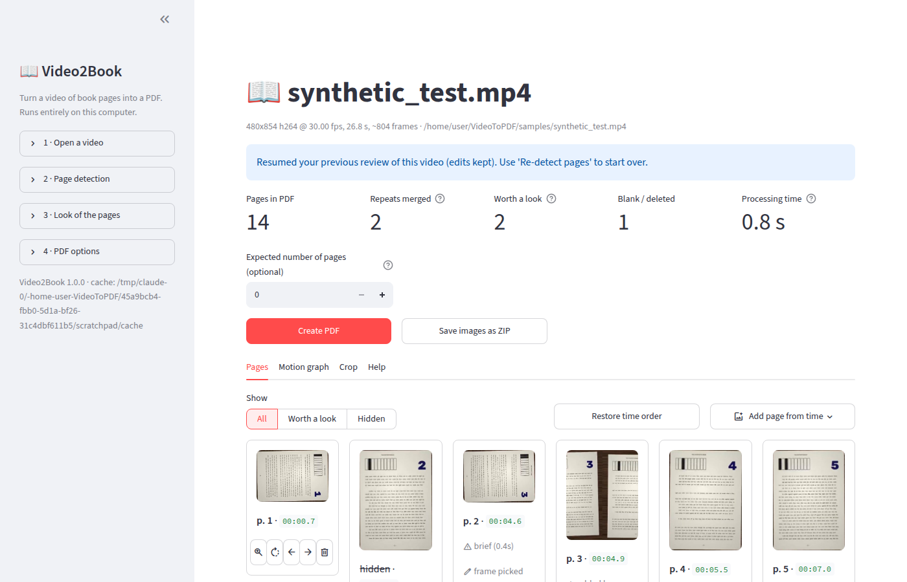
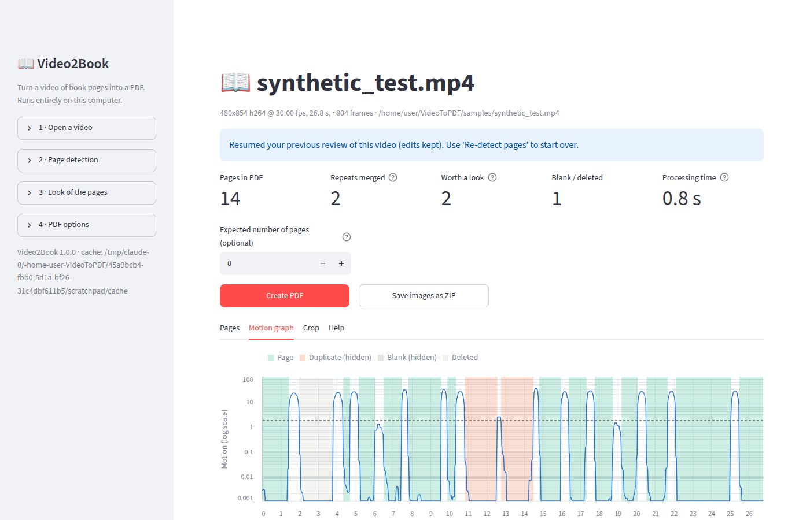

# Video2Book

Turn a **video of book pages** (a slideshow, or someone swiping through photos
of every page) back into a **clean PDF**: one PDF page per book page, in the
right order, without duplicates and without blurry in-between frames.

Everything runs **on your own computer**. After installation it works fully
offline, and nothing is uploaded anywhere.



---

## Contents

1. [Install and start (step by step)](#1-install-and-start-step-by-step)
2. [Make a PDF](#2-make-a-pdf)
3. [Review the pages (optional)](#3-review-the-pages-optional)
4. [Searchable PDF with OCR (optional)](#4-searchable-pdf-with-ocr-optional)
5. [About ffmpeg](#5-about-ffmpeg)
6. [Command line (fully automatic)](#6-command-line-fully-automatic)
   - [A whole series from a YouTube channel (yt2book)](#a-whole-series-from-a-youtube-channel-yt2book)
7. [How it works](#7-how-it-works)
8. [Troubleshooting and tips](#8-troubleshooting-and-tips)
9. [Known limitations](#9-known-limitations)
10. [For developers](#10-for-developers)

---

## 1. Install and start (step by step)

You need **Python 3.10 or newer** (free). The first start needs an internet
connection to download the program's components (about 300 MB). After that no
internet is needed.

### Windows

1. **Install Python.** Go to <https://www.python.org/downloads/>, click the
   big yellow *Download Python* button and run the installer.
   On the first screen **tick "Add python.exe to PATH"**, then click
   *Install Now*.
2. **Download Video2Book.** On this project's GitHub page click the green
   **Code** button → **Download ZIP**. Right-click the downloaded ZIP →
   *Extract All...* and pick a folder (e.g. *Documents*).
3. **Start it.** Open the extracted folder and double-click
   **`Start-Video2Book-Windows.bat`**.
   - The first time, a black window installs everything (a few minutes).
     If Windows shows *"Windows protected your PC"*, click *More info* →
     *Run anyway*.
   - Then your web browser opens **Video2Book** at `http://localhost:8501`.
4. Keep the black window open while you use the app. Close it to stop.

### macOS

1. **Install Python** from <https://www.python.org/downloads/> (download the
   macOS installer, open it and follow the steps).
2. **Download Video2Book**: green **Code** button → **Download ZIP**, then
   double-click the ZIP to extract it.
3. **Start it**: in the extracted folder, **right-click
   `Start-Video2Book-Mac.command` → Open** (the first time macOS asks for
   confirmation because the file comes from the internet; after that a
   double-click is enough).
   The first start installs everything (a few minutes), then your browser opens
   Video2Book.
4. Keep the Terminal window open while you use the app.

### Linux

```bash
sudo apt install python3 python3-venv      # Debian/Ubuntu; use your distro's equivalent
# download + extract the ZIP (or git clone), then in that folder:
./start-video2book-linux.sh
```

The browser opens at `http://localhost:8501` (open it yourself if it doesn't).

### Manual installation (any system)

```bash
python -m venv .venv
# Windows: .venv\Scripts\activate        macOS/Linux: source .venv/bin/activate
pip install -e ".[ocr]"          # or: pip install -r requirements.txt
video2book-app                    # the web interface
video2book --help                 # the command line tool
```

---

## 2. Make a PDF

1. In the left panel, under **1 · Open a video**, type (or paste) the
   **folder** that contains your video, choose the video in the list and click
   **Open this video**.
   (You can also drop the file on the upload box. For big videos the folder
   option is better: nothing is copied.)
2. Wait while the video is analysed. A progress bar is shown; this takes a few
   seconds per minute of video the first time. The result is cached, so opening
   the same video again is instant.
3. Click **Create PDF**. The PDF is saved **next to your video** (same name,
   `.pdf`), and a **Download PDF** button appears too.

That's it for most videos. If you know how many pages the book has, type the
number into **Expected number of pages**: you get a warning if the count
differs, together with a suggested setting when one would help.

Page look and PDF settings are in the left panel:

| Setting | Options |
|---|---|
| **3 · Look of the pages** | *Original*, *Clean* (auto-contrast, white balance, light sharpening), *Black & white scan* (like a photocopy; small files) |
| **4 · PDF options** | Page size *Fit to image* / *A4* / *Letter*, resolution (DPI), JPEG quality, searchable PDF (OCR) |
| **Crop** tab | *Automatic* (finds the page, removes black bars, phone buttons, background), *Same rectangle for every page* (draw it once with sliders), *No cropping*; optional **perspective correction** for pages photographed at an angle |

**Save images as ZIP** exports every page as an image file instead.

---

## 3. Review the pages (optional)

The **Pages** tab shows every page with its number and the moment it appears
in the video (`mm:ss.s`).

| Button | What it does |
|---|---|
| 🔍 (zoom) | Open the page large: rotate, move it to another page number, delete/restore, and **pick a better frame** from the neighbouring frames (or scrub to any moment) |
| ⟳ | Rotate 90° clockwise |
| ← → | Move one place earlier / later |
| 🗑 / ↶ | Delete / restore |

* **Show → Worth a look**: pages that might be a repeat of another page, pages
  that were shown very briefly, and pages that were moving (zoom/pan effect).
* **Show → Hidden**: repeats that were merged automatically (a page shown
  twice, e.g. after swiping back), blank frames, and deleted pages. Nothing is
  thrown away: click ↶ to bring a page back.
* **Add page from time**: if the detector missed a page, type the time where
  it is visible (e.g. `1:23.5`), check the preview and click *Insert*.
* **Restore time order** undoes any reordering.
* The **Motion graph** tab shows how much the picture changes over time. The
  shaded spans are the detected pages and the dashed line is the detection
  threshold. Hover to see times.



**Detection settings** (left panel → *2 · Page detection*): *Sensitivity*
moves the threshold. **Pages missing → raise it; one page split in two → lower
it**, then click **Re-detect pages**. This re-uses the cached analysis, so it
takes seconds. Your review edits are reset, but pages you added by hand are
kept.

Your review is saved automatically: open the same video later and you continue
where you stopped.

---

## 4. Searchable PDF with OCR (optional)

With OCR, the PDF contains invisible text, so you can search and copy text.
It needs two free programs, **Tesseract** (the text recognizer) and
**Ghostscript**. The launchers already install the Python part (OCRmyPDF).

| System | Install |
|---|---|
| **Windows** | Tesseract: installer from <https://github.com/UB-Mannheim/tesseract/wiki> (during setup, open *Additional language data* and tick your languages). Ghostscript: <https://ghostscript.com/releases/gsdnld.html> (64-bit). Or in a terminal: `winget install UB-Mannheim.TesseractOCR` and `winget install ArtifexSoftware.GhostScript`. If the app still says Tesseract is missing, add `C:\Program Files\Tesseract-OCR` to your PATH and restart the app. |
| **macOS** | Install [Homebrew](https://brew.sh), then `brew install tesseract tesseract-lang ghostscript` |
| **Linux** | `sudo apt install tesseract-ocr ghostscript` plus language packs, e.g. `tesseract-ocr-fra tesseract-ocr-deu` |

Restart Video2Book. Under **4 · PDF options** tick **Searchable PDF (OCR)**
and enter the language code(s): `eng`, `fra`, `deu`, `spa`, `ita`... or several
at once, e.g. `fra+eng`.

---

## 5. About ffmpeg

**You don't need to install ffmpeg.** Video2Book reads videos with
[PyAV](https://pyav.org), whose installation already contains the FFmpeg
decoding libraries (H.264, HEVC/H.265, VP9, AV1, MP4, MOV, MKV, WebM...).
Rotation metadata from phones is applied automatically.

Install the ffmpeg command line tools only if you want to inspect or convert
videos yourself:

| System | Install |
|---|---|
| Windows | `winget install Gyan.FFmpeg` (or a build from <https://www.gyan.dev/ffmpeg/builds/>, added to PATH) |
| macOS | `brew install ffmpeg` |
| Linux | `sudo apt install ffmpeg` |

Useful example: `ffprobe -hide_banner my_video.mp4` prints resolution, frame
rate, codec and rotation.

---

## 6. Command line (fully automatic)

```bash
video2book input.mp4 -o book.pdf --expected-pages 240 --ocr eng
```

Real output for a 40-page test video (made with `scripts/make_synthetic_video.py`,
where the "reader" swipes back once and shows pages 6 and 7 a second time):

```
$ video2book book.mp4 -o book.pdf --expected-pages 40 --ocr eng
Video: 720x1280 h264 @ 30.00 fps, 68.5 s, ~2055 frames
Motion threshold 1.69 (typical still level 0.02, typical transition 24.2)
Detected 42 still segments -> 40 pages (2 duplicates merged, 0 flagged as possible duplicates, 0 blank)
Review notes:
  00:04.4  page 3: shown only 0.37s - check it's a real page
  00:09.9  page 7: shown only 0.47s - check it's a real page
  00:11.5  duplicate of page 6 - merged
  00:13.7  duplicate of page 7 - merged
  00:38.7  page 22: shown only 0.57s - check it's a real page
  00:39.6  page 23: shown only 0.53s - check it's a real page
  00:59.5  page 36: shown only 0.47s - check it's a real page
OK: 40 pages, as expected.
Wrote book.pdf (40 pages, 3.7 MB, searchable)
Total time 25.3s
```

Useful options (see `video2book --help` for all):

| Option | Meaning |
|---|---|
| `--expected-pages N` | Warn if the page count differs (and say which sensitivity would fix it) |
| `--auto-adjust` | With `--expected-pages`: automatically re-run with the suggested sensitivity |
| `--sensitivity 0..1` | Default 0.5. Higher = more pages |
| `--threshold X` | Manual motion threshold (see the motion graph) |
| `--min-duration S` | Seconds a page must stay still (default 0.3) |
| `--method median\|sharpest` | Page image: median of the still frames (default, removes video noise) or the single sharpest frame |
| `--crop auto\|none\|x0,y0,x1,y1` | Cropping; manual values are fractions of the frame, e.g. `0.05,0.1,0.95,0.9` |
| `--perspective` | Straighten pages photographed at an angle |
| `--enhance original\|clean\|bw` | Enhancement preset |
| `--page-size fit\|a4\|letter`, `--dpi`, `--quality` | PDF layout |
| `--ocr LANG` | Searchable PDF (`eng`, `fra+eng`, ...) |
| `--zip pages.zip` | Also export the page images |
| `--report report.json` | Machine-readable report: every page with time, status, flags, crop |
| `--plot motion.png` | Save the motion graph (needs `pip install matplotlib`) |
| `--step N` | Analyse every Nth frame (faster first run on long 60 fps videos) |
| `--no-dedup`, `--no-cache`, `--cache-dir DIR` | ... |

### A whole series from a YouTube channel (yt2book)

If a channel publishes a series as one video per chapter, titled like
**"Miss Forensics (Chapter 142)"**, Video2Book can fetch the chapters and make
one PDF per chapter:

```bash
yt2book https://www.youtube.com/@RuiNemesys "Miss Forensics" --latest 5      # the 5 latest chapters
yt2book @RuiNemesys "Miss Forensics" --chapters 140-145                    # a range (or 3,5,9-11)
yt2book @RuiNemesys "Miss Forensics"                                       # every chapter
yt2book @RuiNemesys "Miss Forensics" --list                                # just show what's there
```

(From the launchers' installation, the command is `.venv/bin/yt2book` on
macOS/Linux and `.venv\Scripts\yt2book` on Windows.) The same is available in
the web app: switch the left panel from **Single video** to **YouTube series**.

* Titles are matched loosely: `Miss Forensics - Ch. 12`, `【Miss Forensics】Chapter 12`,
  `Miss Forensics (Chapter 12-13)` all count. A different series with a longer
  name (`Miss Forensics 2 (Chapter 1)`) does not. If a chapter was uploaded
  twice, the newest upload is used.
* Each chapter is downloaded at **720p** (video only; the sound isn't needed).
  If there's no 720p version, the closest lower quality is used and the report
  says so. `--height` changes the target.
* PDFs go to `~/Video2Book/<series>/<series> - Chapter 142.pdf` (`-o` to change),
  plus a `report.json`. By default each PDF page takes the size of its picture
  (`--page-size a4` for A4 pages).
* Chapters that already have a PDF are skipped: just run the same command again
  after an interruption or when new chapters are out (`--force` redoes them).
* Downloaded videos are deleted after conversion. Use `--keep-videos` if you
  want to fix pages later in the review screen.
* If YouTube answers "Sign in to confirm you're not a bot", add
  `--cookies-from-browser firefox` (or `chrome`...) to use the login of a
  browser where you're signed in to YouTube.
* The channel's video list is cached for 6 hours (`--refresh` to re-read it).
  `--latest N` doesn't read the whole channel: it stops shortly after finding
  N chapters.

Downloading YouTube videos is against YouTube's terms of service; use this only
for your own personal reading, and support the creators and publishers.

---

## 7. How it works

1. **Read the video** once, streaming (constant memory), with a progress bar.
   For speed, only the brightness plane of each frame is used, downscaled to
   160 px wide.
2. **Motion signal**: the mean difference between consecutive frames.
3. **Still segments**: the signal is smoothed with a short running median, so
   one-frame compression "pops" are ignored. Two levels are measured *from the
   video itself*: the typical level while a page is shown (compression noise,
   or a slow zoom) and the typical height of transition peaks. The threshold
   sits between them on a log scale; *sensitivity* moves it. Stretches that
   stay below it for at least `min-duration` are pages.
4. **Hidden transitions**: a gentle cross-fade between two very similar pages
   can stay under the threshold. Clear bumps inside a segment are checked by
   comparing the actual frames on both sides, and the segment is split only if
   they really differ.
5. **Best image per page**: inside each segment, the calmest part is used (never
   the ease-in/out of a transition, never a fade-in). By default the result is
   the per-pixel **median** of up to 9 aligned frames, which removes
   compression noise. If the page is moving (zoom/pan effect), the **sharpest**
   frame is used instead.
6. **Duplicates**: pages are compared (after aligning them) with a perceptual
   hash and SSIM at 512 px, and the largest *local* difference is checked too.
   Only clearly identical pages are merged (hidden, never deleted). If two pages
   are identical except for one spot, such as a page number, or are merely very
   similar, the page is kept and **flagged** for you to check.
7. **Cropping**: things that are identical on every page (phone status bar,
   gallery buttons, black bars) are removed first. Then, per page, the paper
   is found (a bright, sharp-edged rectangle holding the text), or else the
   area with real detail. The detail fallback removes the blurred copies that
   slideshow apps put behind pictures.
8. **Export** with img2pdf (JPEG pages are embedded without re-compression
   loss; black & white pages as 1-bit), optionally made searchable with
   OCRmyPDF + Tesseract.

The motion signal and every page image are **cached** per video (by content,
not name), in your user cache folder (shown at the bottom of the left panel).
Changing settings never re-reads the whole video.

---

## 8. Troubleshooting and tips

| Problem | What to do |
|---|---|
| Pages are missing | Raise **Sensitivity** (or lower *Minimum still time*) and click *Re-detect pages*, or use *Add page from time*. Typing the expected page count tells you which sensitivity to use. |
| One page appears twice in a row | Lower sensitivity, or delete one. Real repeats (swiping back) are merged automatically: see *Hidden*. |
| A page is blurry or caught mid-swipe | 🔍 → *Pick a better frame*, or scrub to the right moment. *Sharpest frame* mode can help for shaky videos. |
| Crop cuts off part of the page | Crop tab → *Same rectangle for every page* (start from the automatic one and adjust), or *No cropping*. |
| Pages are tilted / keystoned | Crop tab → *Straighten photographed pages*. |
| First analysis is slow | Long 60 fps videos: set *Analyse every Nth frame* to 2. |
| Very large video won't upload | Use the **Folder** option instead of the upload box. |
| "OCR unavailable" | Install Tesseract and Ghostscript (section 4) and restart the app. |
| Free disk space | Delete the cache folder shown at the bottom of the left panel (it is re-created when needed). |
| Port already in use | Another copy is running; close it, or set the environment variable `VIDEO2BOOK_PORT=8502`. |

Privacy: the web interface only listens on `localhost` (not reachable from other
computers), and Streamlit's usage statistics are switched off.

---

## 9. Known limitations

* The PDF can't be sharper than the video. A 360p video of text gives hard to
  read pages whatever the settings (OCR quality suffers too).
* A **cross-fade between two nearly identical pages during a continuous zoom
  effect** can't be seen in the motion signal, so the two pages are merged into
  one. Transitions that are much weaker than the others in the same video (slow
  fades mixed with fast slides, plus a zoom effect) can also be missed at the
  default sensitivity. The *expected number of pages* check finds the
  sensitivity that recovers them, or add the page from its time.
* A page repeated at a *different zoom level* (Ken Burns effect) is not
  recognised as a repeat. Both copies are kept.
* In extremely compressed video, two pages differing **only** by a small page
  number can look identical and be merged. They are hidden, not deleted: check
  *Hidden*.
* Perspective correction recovers the page's shape from its 4 corners; the exact
  aspect ratio of the paper can't be known from a single photo.

---

## 10. For developers

```
video2book/
  video.py      PyAV reader: metadata, rotation, fast luma pass, random access by pts
  motion.py     motion signal (+ save/load for the cache)
  segments.py   adaptive threshold, still segments, calm core, hidden-transition candidates
  extract.py    median / sharpest page image
  dedup.py      pHash + aligned SSIM + local-outlier duplicate detection
  crop.py       static border, uniform bars, paper, detail box, manual, perspective
  enhance.py    presets
  export.py     img2pdf PDF, OCRmyPDF, ZIP
  project.py    Pipeline (cache, run, edits, render, export) and Project state (JSON)
  cli.py        `video2book` command
  app.py        Streamlit UI;  launch.py: `video2book-app`
  youtube.py    channel listing, chapter title matching, 720p download, per-chapter conversion
  yt_cli.py     `yt2book` command;  app_youtube.py: the "YouTube series" page
  synthetic.py  synthetic test video generator
scripts/make_synthetic_video.py
tests/          pytest suite (unit + end-to-end on generated videos)
```

```bash
pip install -e ".[dev,ocr]"
pytest                                   # ~50 tests, about a minute
python scripts/make_synthetic_video.py out/test.mp4 --pages 40 --width 720 --height 1280
video2book out/test.mp4 --expected-pages 40 --report out/report.json --plot out/motion.png
```

The synthetic generator makes phone-slideshow videos from generated book
pages. Each page has a big unique number and a bar code, and some pairs are
nearly identical (same text, only the number differs). The videos include slide
and cross-fade transitions with easing, irregular hold times (0.4 s to 3 s), a
swipe back (two pages shown again), a fake phone UI over black bars, pages
photographed on a wooden table with tilt and vignetting, H.264 compression, and
optionally rotation metadata and a Ken Burns zoom. A ground-truth JSON is
written next to the video. The end-to-end tests check that the page count
**and order** are exactly right on several variants (plain, rotated, heavily
compressed, zooming).

The library has no UI dependencies (`from video2book.project import Pipeline`).
Minimal use:

```python
from video2book.project import Pipeline, Settings
pipe = Pipeline("book.mp4", Settings(sensitivity=0.5, enhance="clean"))
project = pipe.run()
print(project.summary())
pipe.export_pdf(project, "book.pdf")
```
